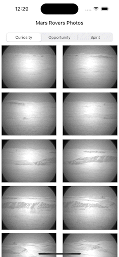

# NASA-Rovers
### Description
This app shows the most recent photos of NASA's rovers(curiosity, opportunity, spirit). It uses the web service https://api.nasa.gov/mars-photos/api/v1 to provide its data.
The project uses CocoaPods as its dependency manager and currently has only Almorife as a third-party dependency.
All the design is built using Interface Builder and the code is using MVVM and written entirely using Swift.

## Recording

## Platform
iOS
- Minimum Version: 12.2

## Configuration
To manage the dependencies of the project was used [CocoaPods](https://cocoapods.org/).

First, it's necessary to clone the project.

`- git clone https://github.com/cardoso19/NASA-Rovers.git`

If you don't have CocoaPods installed on your computer yet, run the code below on the terminal to install it:

`sudo gem install cocoapods`

After the project had been cloned, inside of the generated directory, using Terminal execute the command:

`pod install`

With the dependencies management done, to run the project you need to open it by clicking on the file "NASA Probes.xcworkspace".

## Third-Party library used
- [Alamofire](https://github.com/Alamofire/Alamofire): It was chosen for its easy utilization and for its reliability with requests of all kinds of types. It was used on each request that the app made to the backend.
